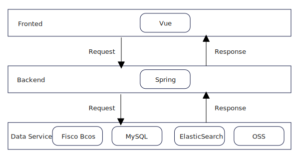
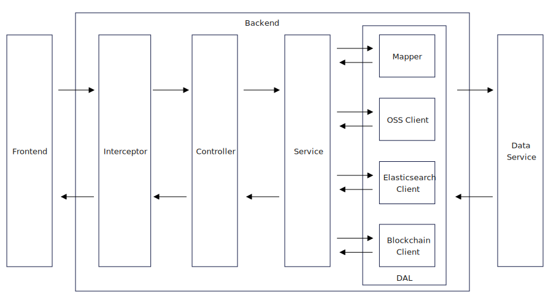

# Data Element Market Supply-Side Management System - Backend

Frontend: [yexca/data-element-frontend](https://github.com/yexca/data-element-frontend)  
Deploy(Docker): [yexca/data-element-docker](https://github.com/yexca/data-element-docker)

## Overview

This project is a management system focused on the "supply side" of the data element market, developed to address the data explosion driven by the Fourth Industrial Revolution and the rise of Generative AI.

To overcome the challenges of traditional centralized data management, this system innovatively integrates SpringBoot, Elasticsearch, and the Web3 foundational technology of blockchain (Fisco Bcos). This integration provides efficient data search capabilities and immutable record-keeping, ensuring data authenticity and ownership.

## 🏗 System Architecture

The system adopts a sophisticated microservice-oriented architecture with a clear separation of concerns.

### System Topology



### Backend Logic Flow



**Architectural Highlights:**
* **Data Services Layer:** Orchestrates four distinct storage engines:
    * **MySQL:** For structured relational data (User/Product info).
    * **Elasticsearch:** For high-performance full-text search.
    * **Fisco Bcos (Blockchain):** For immutable transaction records and ownership tracing.
    * **OSS:** For unstructured object storage (files/samples).
* **Interceptor Pattern:** A unified security layer handles JWT validation before requests reach the Controller.

<details>
<summary><b>💾 Database Design (E-R Diagram)</b></summary>

The database schema is designed to support RBAC (Role-Based Access Control) and complex data product relationships.

<div align="center">
    
    <br>
    <em>Entity-Relationship Diagram illustrating Users, Roles, and Data Products</em>
</div>

</details>

## 🌟 Main Features

  * **RESTful APIs:** A suite of standardized APIs, designed and managed with Apifox, for communication with the frontend.
  * **Authentication & Authorization:** A JWT (JSON Web Token) based authentication system with request validation handled by interceptors.
  * **Role-Based Access Control (RBAC):** Fine-grained access control supporting multiple roles, including "Individual/Enterprise User" and "Employee/Administrator/Super Administrator".
  * **Data Search:** Leverages Elasticsearch to provide high-speed, full-text search capabilities for data products (utilizing the `ik_max_word` Chinese tokenizer).
  * **Blockchain Integration:** Records user registration information and data product metadata on the Fisco Bcos blockchain to ensure immutability of ownership and history.
  * **Unstructured Data Management:** Manages user-uploaded data product files (or samples) using OSS (Object Storage Service).
  * **Robust Architecture:** Employs a layered architecture with a clear separation of concerns (Controller, Service, and Mapper/Data Access Layer).

## 🛠 Tech Stack

| Category | Technology |
| :--- | :--- |
| **Core** | Java 17, Spring Boot |
| **Framework** | Spring MVC, MyBatis |
| **Database** | MySQL 8.2 |
| **Search Engine** | Elasticsearch 7.12.1 |
| **Blockchain** | Fisco Bcos |
| **Object Storage** | S3-compatible Object Storage |
| **Authentication** | JWT (JSON Web Token) |
| **Build / Deployment** | Maven, Docker / Docker Compose |

## Getting Started

### 🐳 Quick Deployment

If you just want to deploy and run the system, please visit the deployment repository for Docker Compose instructions: [yexca/data-element-docker](https://github.com/yexca/data-element-docker)

### 💻 Local Development

To run or modify the backend locally:

**1. Clone the repository**

```bash
git clone https://github.com/yexca/data-element-backend.git
cd data-element-backend
```

**2. Configure the application**

Update `data-server/src/main/resources/application.yml`(and `application-prod.yml`) with your own infrastructure settings:

- MySQL database connection
- Elasticsearch URI
- S3-compatible Object Storage credentials
- *(Optional) Enable Fisco Bcos blockchain support and place the related files(abi, bin, conf) into `data-server/src/main/resources`*

**3. Run the application**

Start the project via your IDE or use Maven:

```bash
mvn spring-boot:run
```
